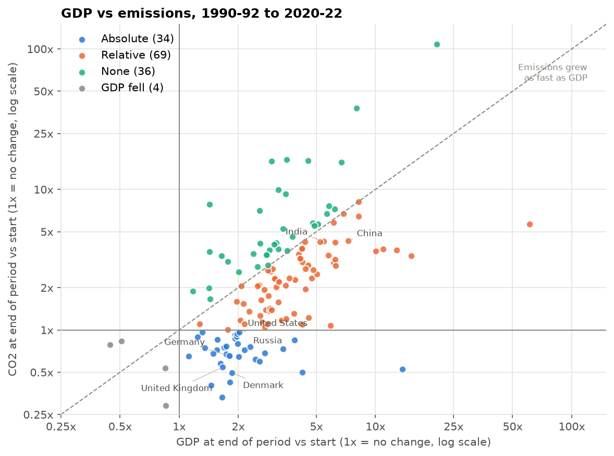
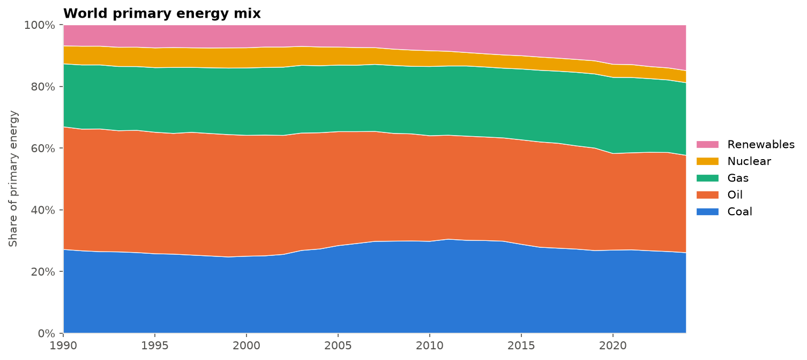
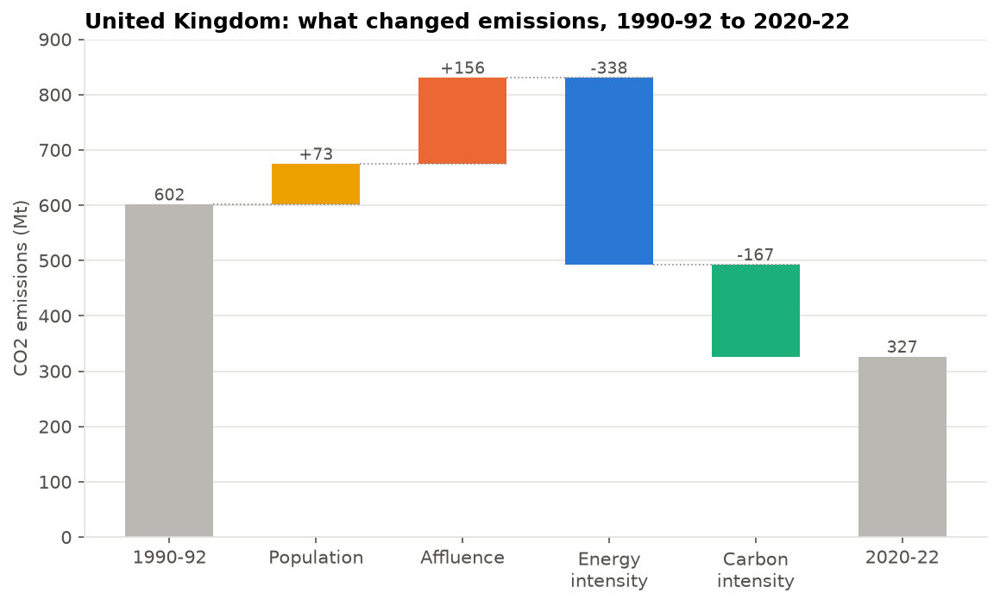
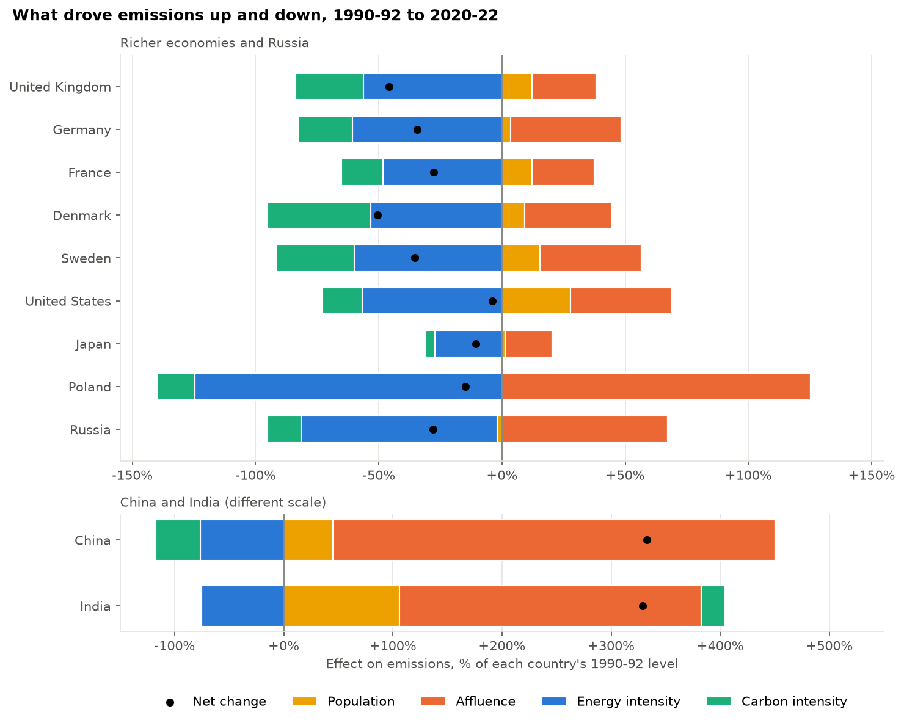
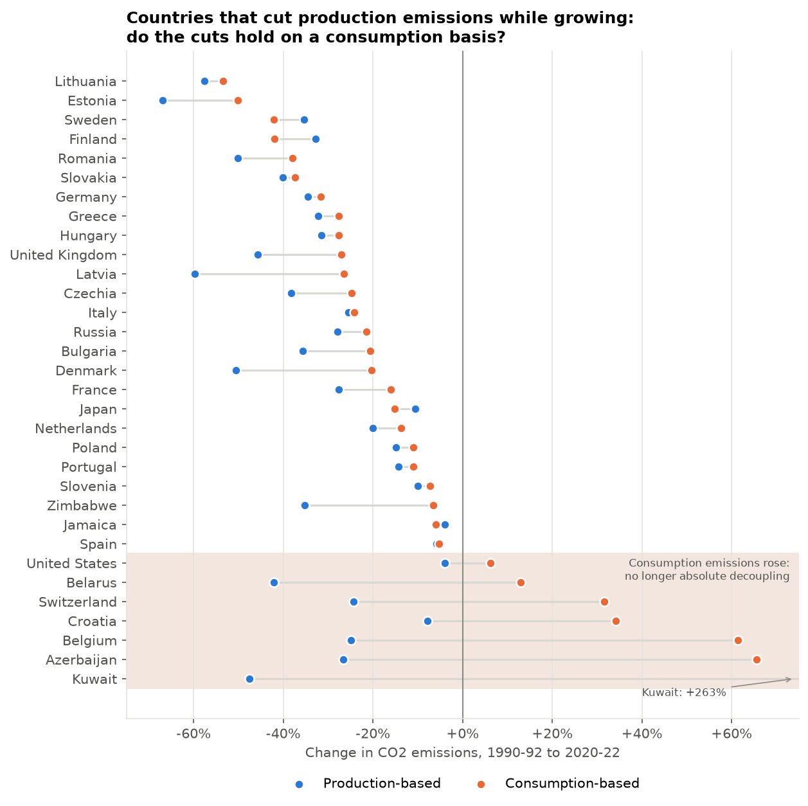

# Global Energy Transition Explorer

**Which countries have grown their economies while cutting carbon emissions, what actually drove the change, and does the progress hold up once imported goods are counted?**

An end-to-end analysis of 143 countries from 1990 to 2022 using Our World in Data's CO2 and energy datasets. It combines economic decomposition methods (the Kaya identity with LMDI) with careful data checks to separate genuine decarbonisation from growth, recessions, historical accidents and offshoring.



---

## The short version

- **About a quarter of countries (34 of 143) grew their economies while cutting CO2 emissions** between 1990 and 2022. Most of the rest now produce less CO2 per unit of GDP, but their total emissions still rose.
- **It's becoming more common.** 28 countries managed it in 1990 to 2005, rising to 40 in 2005 to 2022, including the US, Japan, France, Canada and Australia.
- **Some "successes" weren't what they seemed.** Russia, Azerbaijan and Kuwait only qualify because their emissions collapsed in the early 1990s. Greece and Italy's more recent cuts came partly from shrinking economies.
- **Efficiency did most of the work, not clean energy.** Using less energy per unit of GDP was the bigger reason for falling emissions in 30 of the 34 countries that decoupled.
- **Offshoring flatters the numbers, but doesn't explain them away.** Once emissions from imported goods are counted, 25 of 32 decouplers still cut emissions. The UK's cut shrinks from 46% to 27%, and the US drops out altogether.
- **Globally, the transition is catching up but hasn't caught up.** The combined economy nearly tripled while emissions rose 60%. Efficiency and cleaner energy now offset about 65% of the growth-driven rise in emissions, up from 54%.

---

## Why this question?

Climate targets depend on one idea: that economies can keep growing while emissions fall. This is called **decoupling**. Headlines often say rich countries have achieved it, but a simple "GDP up, emissions down" comparison hides a lot. Emissions can fall because of a recession, because an economy collapsed, or because factories moved abroad. None of those are an energy transition.

This project asks three questions in order:

1. **Who** has decoupled, and has it lasted?
2. **Why** did emissions change: population, wealth, efficiency or cleaner energy?
3. **Is it real**, or did rich countries partly move their emissions overseas?

---

## Key findings

### 1. The global energy mix has changed less than you might think



Fossil fuels supplied 87% of the world's primary energy in 1990 and 83% in 2022. Coal's global share barely moved (27% in both years), because cuts in Europe were matched by growth in Asia. At country level the picture is very different: Poland, Denmark, Czechia and the UK each cut coal's share by more than 25 percentage points. Some replaced it mainly with gas (Greece, Spain, Hong Kong), others mainly with renewables or nuclear (Denmark, the UK, Ireland, Czechia).

### 2. Decoupling is real, spreading, and mostly a rich-country story

| Decoupling type | What it means | Countries (1990 to 2022) |
|---|---|---|
| Absolute | GDP grew, emissions fell | 34 |
| Relative | Both grew, but emissions grew more slowly | 69 |
| No decoupling | Emissions grew as fast as GDP, or faster | 36 |
| GDP fell | The economy shrank over the period | 4 |

Over half of the richest quarter of countries absolutely decoupled, against one country in the poorest quarter. Splitting the period at 2005 showed two things: some early "decoupling" came from the post-Soviet collapse rather than climate policy, and the number of absolute decouplers rose from 28 to 40 in the more recent period.

### 3. Why emissions changed: efficiency did most of the work



The Kaya decomposition splits each country's change in emissions into four drivers. For the UK, more people and higher incomes would have added about 230 Mt of CO2 on their own. A less energy-hungry economy removed about 340 Mt, and cleaner energy removed another 170 Mt.



Across countries, falling energy intensity was the biggest brake on emissions almost everywhere. Denmark is the standout for cleaner energy, which cut its emissions by 42% on its own. China's rising incomes would have multiplied its emissions about five times, far more than efficiency could offset. India's energy became more carbon-intensive as coal use grew.

### 4. Offshoring: part of the story, not most of it



Rich countries import far more carbon in goods than they export. The UK consumes 52% more CO2 than it produces, and China exports about 1.2 billion tonnes a year embedded in goods. Re-running the decoupling test with **consumption-based emissions** (which count imports and remove exports):

- 25 of the 32 countries still decoupled, including the UK, Germany, France, Sweden and Japan
- but most cuts were smaller: the UK's shrank from 46% to 27%, Denmark's from 51% to 20%
- the United States, Switzerland and Belgium drop out, as their consumption emissions rose

---

## Methods

### Data
[Our World in Data](https://ourworldindata.org/co2-and-greenhouse-gas-emissions) CO2 and energy datasets (CC BY 4.0), which bring together the Global Carbon Project, the Energy Institute Statistical Review, the Maddison Project (GDP) and UN population estimates. The download date and a SHA-256 checksum for each file are stored in `data/manifest.json`, so any result can be traced to the exact data version used.

### Sample decisions
| Decision | Choice | Reason |
|---|---|---|
| Period | 1990 to 2022 | Consumption-based emissions start in 1990; GDP data ends in 2022 |
| Countries | 143 | Complete data for the whole period, and at least 1 million people |
| Start and end points | 3-year averages (1990-92, 2020-22) | Stops single unusual years (the 1991 Gulf War, COVID) driving results |
| Regional totals | Removed | "World", "Europe" etc. would double count |

Countries under 1 million people were excluded because tiny economies produce extreme percentage swings; together they account for 0.05% of emissions. Using averaged end points changed the decoupling category of only 8 of 143 countries, all close to a boundary.

### Decoupling
Countries are classified by comparing GDP growth with CO2 growth between the averaged start and end points. The same test is repeated for 1990 to 2005 and 2005 to 2022 to check whether results are sustained.

### Kaya identity and LMDI decomposition

$$\text{CO}_2 = \text{Population} \times \frac{\text{GDP}}{\text{Population}} \times \frac{\text{Energy}}{\text{GDP}} \times \frac{\text{CO}_2}{\text{Energy}}$$

The four terms are population, affluence, energy intensity and carbon intensity. The additive **Logarithmic Mean Divisia Index (LMDI-I)** method (Ang, 2005) attributes the change in emissions to each term. It was chosen because the four effects add up exactly to the observed change, with no unexplained residual. In this project the largest residual across all countries was about 3 × 10⁻¹² Mt, which is floating-point rounding.

### Consumption-based emissions
Consumption emissions = production emissions + emissions in imports − emissions in exports. The decoupling test is re-run on the 109 countries with consumption data (97% of the sample's emissions) so production and consumption results are compared like for like.

### Checks run before the analysis
- No zero or negative values in any Kaya input (required for the log-based method)
- Consumption = production + net trade holds to within 0.001 Mt in every row
- Large year-on-year jumps investigated individually (mostly real events such as Kuwait's 1991 oil fires)
- Countries sum to within 2.4 to 3.4% of the World total, the gap being international shipping and aviation

---

## Limitations

- **Energy intensity mixes efficiency with structural change.** A shift from heavy industry to services lowers energy intensity just as better technology does. The offshoring analysis addresses part of this, but not all.
- **Consumption-based emissions are modelled**, using global input-output tables, and carry more uncertainty than production figures, especially in the early 1990s.
- **The detailed energy mix covers 76 of 143 countries** (97% of emissions). Smaller, lower-income economies are under-represented in the energy-mix results.
- **CO2 includes cement and gas flaring**, so carbon intensity is slightly broader than "how clean is the energy".
- **Some countries are excluded**: those without continuous data since 1990 (for example Serbia and the UAE), countries under 1 million people, and Kosovo, which has no ISO code in the source.
- **GDP is measured in 2011 international dollars (purchasing power parity).** A different GDP measure would shift the split between affluence and energy intensity slightly.

---

## Repository structure

```
energy-transition-explorer/
├── notebooks/
│   ├── 00_run_pipeline.ipynb               Downloads and cleans the data
│   ├── 01_data_audit.ipynb                 What the data contains and what was removed
│   ├── 02_data_checks.ipynb                Fitness checks and sample decisions
│   ├── 03_energy_mix_and_decoupling.ipynb  Who decoupled, and did it last?
│   ├── 04_kaya_decomposition.ipynb         Why did emissions change?
│   └── 05_offshoring.ipynb                 Does it survive consumption-based accounting?
├── src/
│   ├── config.py          Paths, URLs and analysis settings in one place
│   ├── download_data.py   Downloads raw data and writes the manifest
│   ├── clean_data.py      Builds the country-year panel
│   ├── sample.py          Sample rules and decoupling classification
│   ├── kaya.py            Kaya factors and LMDI decomposition
│   └── plotting.py        Shared chart style and colours
├── data/
│   ├── raw/               Downloaded files (not committed)
│   ├── processed/         Cleaned files (not committed)
│   └── manifest.json      Download date and checksums
└── outputs/
    ├── figures/           All charts
    └── tables/            Result tables (CSV)
```

Reusable logic lives in `src/` so every notebook applies exactly the same rules. Changing a setting in `config.py`, such as the population threshold, updates every result downstream.

---

## How to run it

**In VS Code (no terminal needed)**
1. Open the project folder in VS Code (with the Python and Jupyter extensions installed).
2. Create an environment: `Ctrl+Shift+P`, then **Python: Create Environment**, choose **Venv**, and tick `requirements.txt`.
3. Open `notebooks/00_run_pipeline.ipynb`, select the `.venv` kernel and click **Run All**.
4. Run notebooks `01` to `05` in order.

**From a terminal**
```bash
python -m venv .venv
# Windows: .venv\Scripts\activate    Mac/Linux: source .venv/bin/activate
pip install -r requirements.txt
python -m src.download_data
python -m src.clean_data
```
Then run the notebooks in order.

Our World in Data updates these files regularly, so a fresh download may shift some figures slightly. The manifest records the version used for the results above.

---

## Tools

Python (pandas, NumPy, Matplotlib), Jupyter, Git and GitHub.

## Data source and licence

Our World in Data, [CO2 and Greenhouse Gas Emissions](https://github.com/owid/co2-data) and [Energy](https://github.com/owid/energy-data) datasets, licensed under CC BY 4.0.

**Reference:** Ang, B.W. (2005). The LMDI approach to decomposition analysis: a practical guide. *Energy Policy*, 33(7), 867-871.

## Author

**Kenneth Marcellus Ehete**
